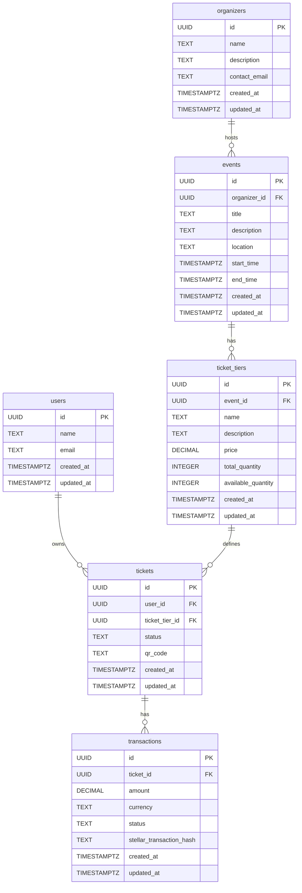

# Database Schema

Source: `server/migrations/20260121174426_initial_schema.sql`

## ER Diagram

## Table Dictionary

### `users`
Registered platform users.

| Column | Type | Constraints | Description |
|---|---|---|---|
| `id` | UUID | PK, default `uuid_generate_v4()` | Unique identifier |
| `name` | TEXT | NOT NULL | Display name |
| `email` | TEXT | UNIQUE, NOT NULL | Login email |
| `created_at` | TIMESTAMPTZ | NOT NULL, default `NOW()` | Record creation time |
| `updated_at` | TIMESTAMPTZ | NOT NULL, default `NOW()` | Last update time (auto-managed by trigger) |

---

### `organizers`
Entities that create and manage events.

| Column | Type | Constraints | Description |
|---|---|---|---|
| `id` | UUID | PK, default `uuid_generate_v4()` | Unique identifier |
| `name` | TEXT | NOT NULL | Organizer name |
| `description` | TEXT | nullable | About the organizer |
| `contact_email` | TEXT | NOT NULL | Public contact email |
| `created_at` | TIMESTAMPTZ | NOT NULL, default `NOW()` | Record creation time |
| `updated_at` | TIMESTAMPTZ | NOT NULL, default `NOW()` | Last update time (auto-managed by trigger) |

---

### `events`
Events created by organizers.

| Column | Type | Constraints | Description |
|---|---|---|---|
| `id` | UUID | PK, default `uuid_generate_v4()` | Unique identifier |
| `organizer_id` | UUID | FK → `organizers(id)`, NOT NULL, **CASCADE DELETE** | Owning organizer |
| `title` | TEXT | NOT NULL | Event title |
| `description` | TEXT | nullable | Event details |
| `location` | TEXT | NOT NULL | Venue or address |
| `start_time` | TIMESTAMPTZ | NOT NULL | Event start |
| `end_time` | TIMESTAMPTZ | nullable | Event end |
| `created_at` | TIMESTAMPTZ | NOT NULL, default `NOW()` | Record creation time |
| `updated_at` | TIMESTAMPTZ | NOT NULL, default `NOW()` | Last update time (auto-managed by trigger) |

---

### `ticket_tiers`
Pricing tiers and capacity for an event.

| Column | Type | Constraints | Description |
|---|---|---|---|
| `id` | UUID | PK, default `uuid_generate_v4()` | Unique identifier |
| `event_id` | UUID | FK → `events(id)`, NOT NULL, **CASCADE DELETE** | Parent event |
| `name` | TEXT | NOT NULL | Tier name (e.g. "General Admission") |
| `description` | TEXT | nullable | Tier details |
| `price` | DECIMAL(10,2) | NOT NULL | Ticket price |
| `total_quantity` | INTEGER | NOT NULL | Total seats available |
| `available_quantity` | INTEGER | NOT NULL | Remaining seats |
| `created_at` | TIMESTAMPTZ | NOT NULL, default `NOW()` | Record creation time |
| `updated_at` | TIMESTAMPTZ | NOT NULL, default `NOW()` | Last update time (auto-managed by trigger) |

---

### `tickets`
Individual tickets purchased by users.

| Column | Type | Constraints | Description |
|---|---|---|---|
| `id` | UUID | PK, default `uuid_generate_v4()` | Unique identifier |
| `user_id` | UUID | FK → `users(id)`, NOT NULL, **CASCADE DELETE** | Ticket holder |
| `ticket_tier_id` | UUID | FK → `ticket_tiers(id)`, NOT NULL, **CASCADE DELETE** | Associated tier |
| `status` | TEXT | NOT NULL | `'active'`, `'used'`, or `'cancelled'` |
| `qr_code` | TEXT | nullable | QR code payload for check-in |
| `created_at` | TIMESTAMPTZ | NOT NULL, default `NOW()` | Record creation time |
| `updated_at` | TIMESTAMPTZ | NOT NULL, default `NOW()` | Last update time (auto-managed by trigger) |

---

### `transactions`
Payment records linked to a ticket purchase.

| Column | Type | Constraints | Description |
|---|---|---|---|
| `id` | UUID | PK, default `uuid_generate_v4()` | Unique identifier |
| `ticket_id` | UUID | FK → `tickets(id)`, NOT NULL, **CASCADE DELETE** | Associated ticket |
| `amount` | DECIMAL(10,2) | NOT NULL | Charged amount |
| `currency` | TEXT | NOT NULL, default `'USD'` | Payment currency |
| `status` | TEXT | NOT NULL | `'pending'`, `'completed'`, or `'failed'` |
| `stellar_transaction_hash` | TEXT | nullable | Stellar blockchain tx hash |
| `created_at` | TIMESTAMPTZ | NOT NULL, default `NOW()` | Record creation time |
| `updated_at` | TIMESTAMPTZ | NOT NULL, default `NOW()` | Last update time (auto-managed by trigger) |

---

## Relationships

| Relationship | Type | Behavior |
|---|---|---|
| `organizers` → `events` | 1:N | Deleting an organizer cascades to all their events |
| `events` → `ticket_tiers` | 1:N | Deleting an event cascades to all its ticket tiers |
| `ticket_tiers` → `tickets` | 1:N | Deleting a tier cascades to all issued tickets |
| `users` → `tickets` | 1:N | Deleting a user cascades to all their tickets |
| `tickets` → `transactions` | 1:N | Deleting a ticket cascades to all its transactions |

All foreign key relationships use `ON DELETE CASCADE`, meaning deletions propagate down the full chain: `organizers → events → ticket_tiers → tickets → transactions`.
